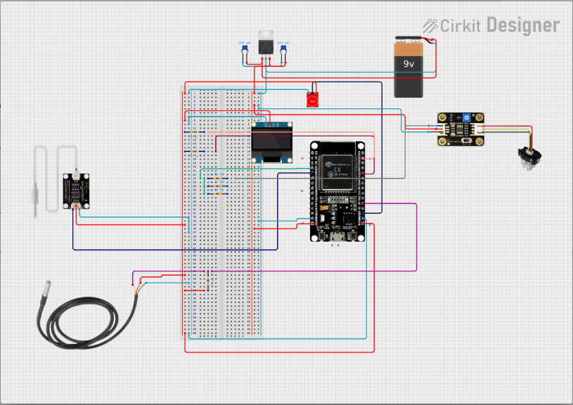
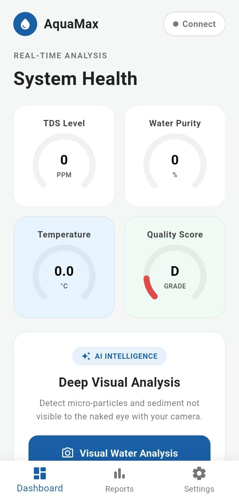
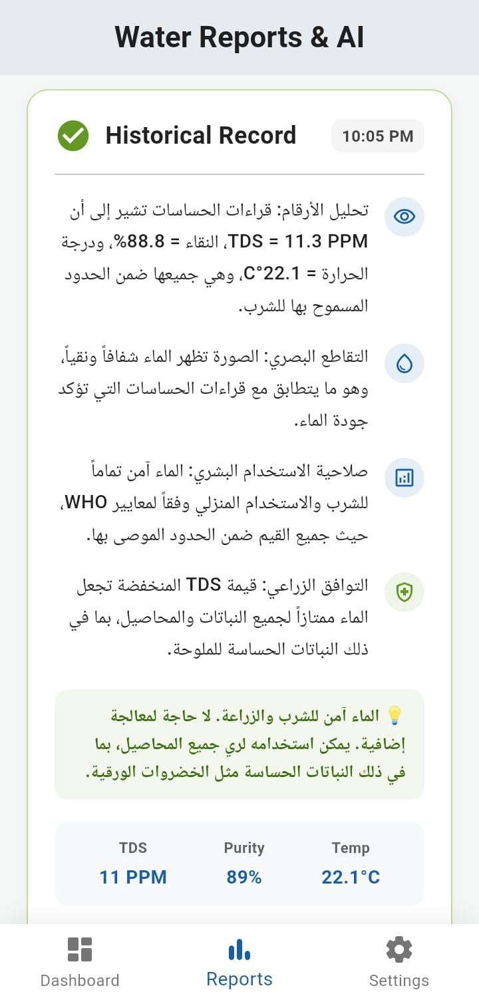
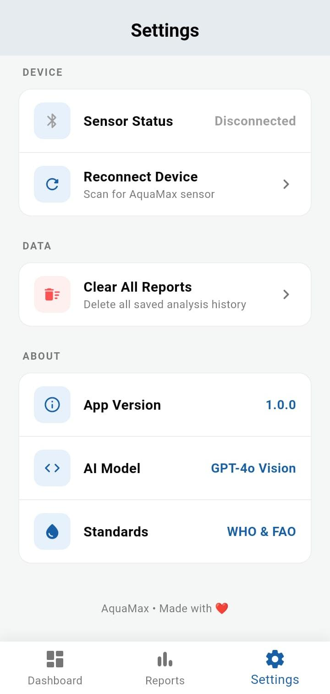

# 💧 AquaMax: AI-Powered Water Quality & Irrigation Monitoring System


---

## 🧠 Overview

**AquaMax** is a comprehensive IoT + AI system designed for real-time water quality monitoring and irrigation decision support.

The project combines:

- ESP32 sensor hardware
- Flutter mobile application
- GPT-4o Vision AI analysis

The system collects physical water parameters, processes them locally on the ESP32, sends them to a mobile app through BLE, and combines them with environmental images for AI-powered agricultural analysis.

---

## 🧩 System Architecture

```text
ESP32 Sensors → BLE → Flutter App → GPT-4o Vision → AI Insights
```

### System Flow

1. Sensors collect water data.
2. ESP32 processes and sends data via BLE.
3. Flutter app receives and visualizes live readings.
4. The app combines sensor data with captured environmental images.
5. Unified data is sent to GPT-4o Vision for intelligent analysis.

---
## Circuit Design
<p align="center">
  
</p>
---
## ⚙️ Hardware Layer (ESP32)

The ESP32 acts as the edge device responsible for:

- Reading sensor data
- Applying basic signal processing
- Broadcasting data via BLE

### Sensors Used

- **TDS Sensor** → Measures dissolved solids in water
- **Turbidity Sensor** → Measures water clarity
- **DS18B20** → Digital temperature sensor

### Example BLE Payload

```json
{
  "tds": 450,
  "turbidity": 120,
  "temp": 25.6
}
```

---

## 📱 Mobile App (Flutter)

Built using Flutter.

## 📸 Screenshots

<p align="center">
  
  
  
</p>

### Features

- Real-time BLE communication
- Live dashboard
- Historical reports
- Local data storage
- AI analysis integration

### Main Screens

- **Dashboard** → Live sensor values
- **Reports** → Historical trends and analytics
- **Settings** → Device pairing and configuration

### Run the App

```bash
cd FlutterApp/aquifer_iq
flutter pub get
flutter run
```

> Note: BLE does not work on most emulators. A physical device is required.

---

## 🧠 AI Vision Analysis (Core Feature)

AquaMax integrates **GPT-4o Vision** as a core system component to enhance decision-making beyond raw sensor data.

The AI module combines:

- Sensor readings
- Environmental images
- Contextual reasoning

to generate smart irrigation and water quality insights.

---

## 📸 AI Processing Pipeline

1. The mobile app captures an image of the environment.
2. The image is encoded and combined with live sensor readings.
3. The unified payload is sent to GPT-4o Vision.
4. The AI model returns structured environmental analysis.

### Example Input

```json
{
  "image": "base64_encoded_image",
  "tds": 450,
  "turbidity": 120,
  "temperature": 25.6
}
```

### Example Output

```json
{
  "water_quality": "moderate",
  "risk_level": "medium",
  "irrigation_recommendation": "suitable with caution",
  "notes": "Possible sediment presence detected."
}
```

---

## 🎯 Why AI Matters

Unlike traditional IoT systems that rely only on numerical sensor readings, AquaMax uses multimodal analysis:

- **Sensor Data** → Precise measurements
- **Vision Data** → Environmental context
- **AI Reasoning** → Actionable insights

### Impact

- Detects issues not visible through sensors alone
- Improves irrigation recommendations
- Enhances agricultural decision-making

---

## 📁 Project Structure

```text
AquaMax/
├── ESP32/        # Firmware (Arduino/C++)
├── FlutterApp/   # Mobile application
└── Design/       # UI/UX assets and mockups
```

---

## 🚀 Getting Started

### ESP32 Firmware

1. Open the `ESP32/` directory
2. Use Arduino IDE or PlatformIO
3. Upload the firmware to the ESP32 board

### Flutter Application

```bash
cd FlutterApp/aquifer_iq
flutter pub get
flutter run
```

---

## 📊 Features

- Real-time water monitoring
- BLE communication
- AI-powered environmental analysis
- Mobile dashboard visualization
- Historical data tracking
- Modular architecture

---

## 🧱 Tech Stack

- ESP32 (Arduino C++)
- Flutter (Dart)
- Bluetooth Low Energy (BLE)
- GPT-4o Vision API

---

## 📄 License

This project is licensed under the MIT License.
